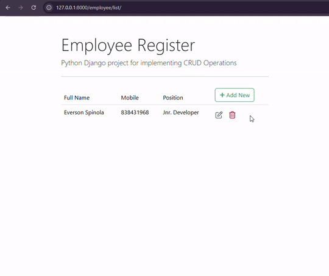
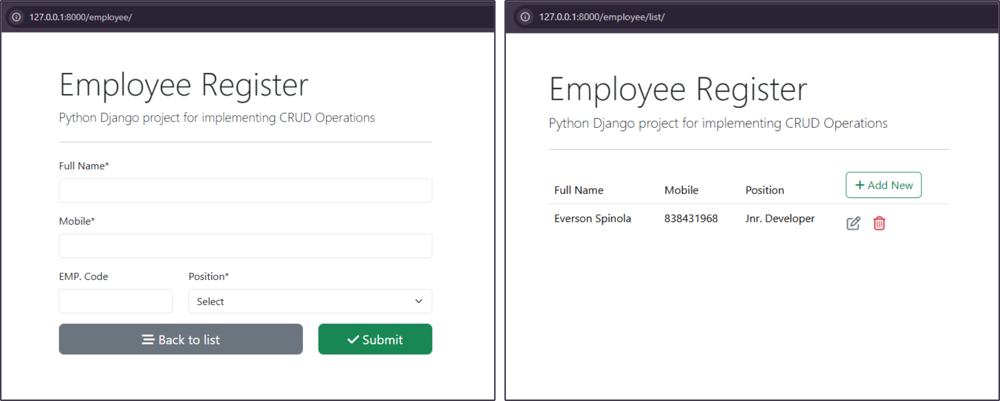

# Full Stack Python Django & PostgreSQL CRUD Web App

##Employee Management CRUD Operation 
This project is a CRUD (Create, Read, Update, Delete) web application built using Python and the Django framework. It enables users to manage employee records, including adding, editing, deleting, and viewing employees.

## Tech Stack
- Backend: Django (Python)
- Database: PostgreSQL
- Frontend: Bootstrap 5, HTML, CSS
- Forms Handling: Django Crispy Forms
- Templating: Django Template Engine
- Database ORM: Django Models
- Version Control: Git & GitHub

## Features
- Employee Management: Add, edit, view, and delete employee records 
- PostgreSQL Integration: Efficient database operations using Django ORM 
- Responsive Design: Uses Bootstrap 5 for a clean UI 
- Form Styling: Implemented using Django Crispy Forms
- Secure CSRF Handling: Protects form submissions
- CRUD Operations: Standard database functionality for employee records

## Contact
For any queries or support, please contact me at 
everson_spinola@hotmail.com.